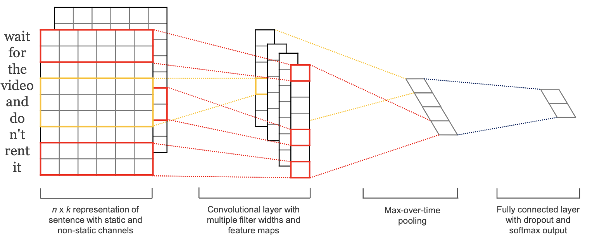
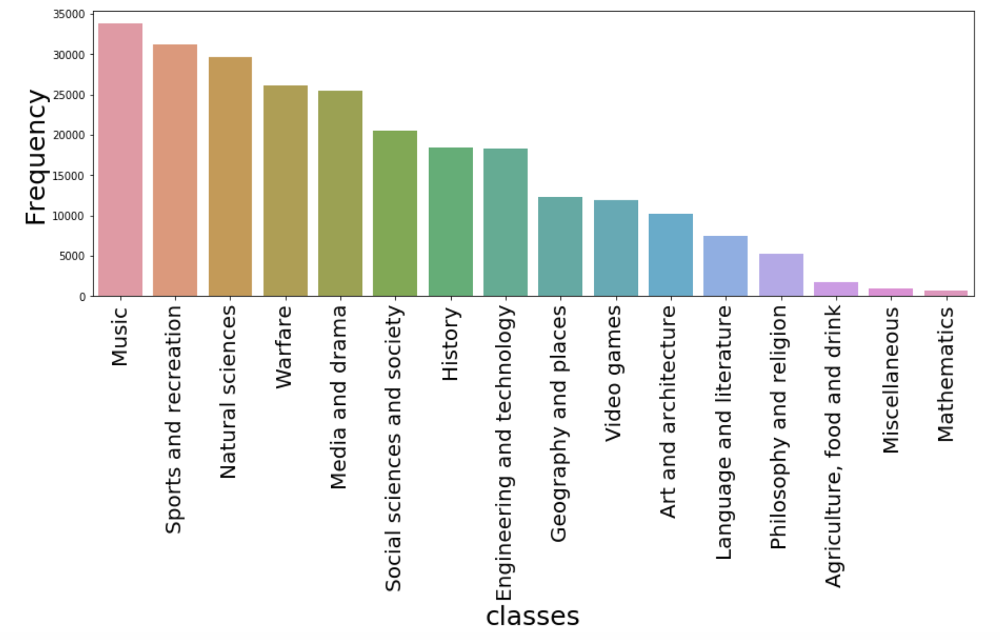
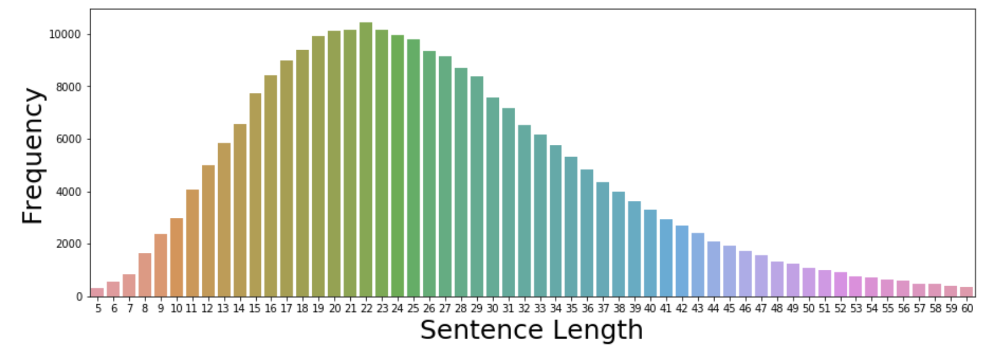

# Text classification using pytorch
This is an easy to understand code for text classification using [Yoon Kim's model](https://www.aclweb.org/anthology/D14-1181.pdf) written in pytorch.



### Data preparation
Input data must be in three files:
* topicclass_train.txt
* topicclass_valid.txt
* topicclass_test.txt

Each file must contain the input examples with one line per example in the following format

>\<label\> ||| \<sentence\>

for instance

>Social sciences and society ||| Several of these rights regulate pre @-@ trial procedure : access to a non @-@ excessive bail , the right to indictment by a grand jury , the right to an information ( charging document ) , the right to a speedy trial , and the right to be tried in a specific venue .

We assume that the data is tokenized and we use python's split function to split it into tokens.

### EDA
Some basic EDA is provided in this [notebook](https://github.com/manikbhandari/cnn-text-classification/blob/master/eda.ipynb).




### Config file
After the data is in the correct format, fill the entries in the config file. 
A template is provided in the repo.


### Train model

```shell script
python run.py -model kim_cnn -lr 0.001 -drop_prob 0.5 -batch_size 4096 -cuda -use_trainable_embed -use_fixed_embed -gpu 0 -epochs 10
``` 
Expected accuracy is 85.5\% on [this](http://phontron.com/data/topicclass-v1.tar.gz) dataset.

### Requirements
Please install the requirements file provided in the repo. 
